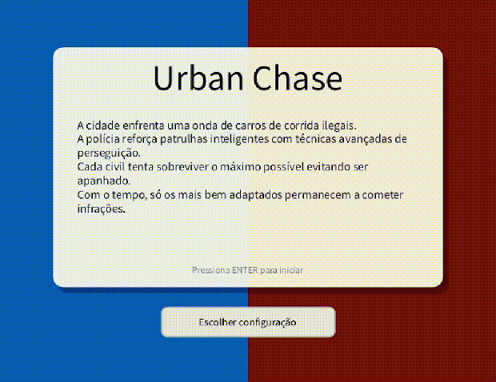
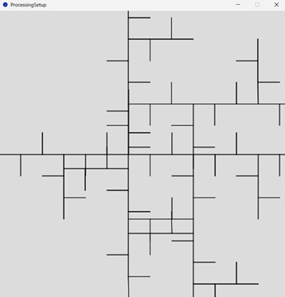
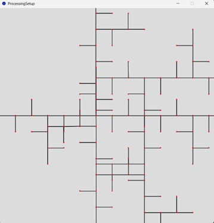
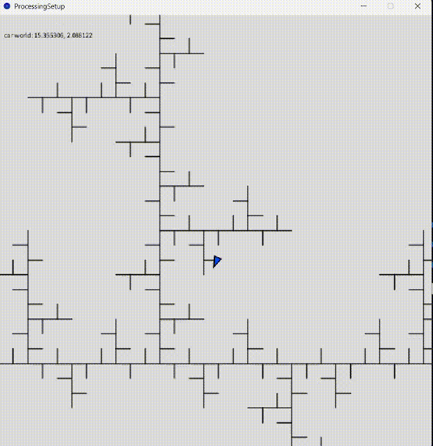

# 🏙️ Urban Chase – Agent-Based Urban Ecosystem Simulation

> Final project for the course **Modelação e Simulação de Sistemas Naturais (MSSN)**  
> BSc in Computer Engineering and Multimedia – **ISEL**  
> Winter semester **2025 / 2026**

---

## 👥 Authors

- **Miguel Cordeiro** — nº 49765 — LEIM  
- **Instructor:** Eng.º Arnaldo Abrantes  

---

## 📝 Project Overview

**Urban Chase** is an interactive agent-based simulation developed in **Java / Processing**, modelling an urban automotive ecosystem where **civil vehicles** and **police vehicles** interact on a procedurally generated city.

The system explores how **global patterns emerge from local rules**, without any form of centralised control, inspired by predator–prey dynamics observed in natural systems.

  

---

## 🧠 Applied Concepts

This project integrates multiple topics from the MSSN syllabus:

- Fractals (L-Systems)  
- Graph-based navigation  
- Autonomous agents (Reynolds / Boids)  
- Group behaviours (pursuit & escape)  
- Particle systems  
- Ecosystem modelling  
- Real-time statistics extraction  

---

## 🌆 City Generation (Fractals)

The city is generated procedurally using **Lindenmayer Systems (L-Systems)**.  
Road segments are produced by interpreting the fractal structure and later converted into a navigable graph.

  

---

## 🛣️ Navigation Graph

Each road segment becomes an edge in a graph, with intersections represented as nodes.  
Agents are constrained to this structure while maintaining continuous motion.

  

---

## 🚗 Autonomous Agents

### Civil Vehicles

Civil agents represent the **prey** of the ecosystem.

**States:**
- Legal  
- Illegal  
- Escape  

They probabilistically become illegal, flee when police are nearby and revert to legal behaviour when safe.

---

### Police Vehicles

Police agents represent the **predators**.

They patrol the city, detect illegal civilians within a vision radius and initiate pursuits.  
Upon capture, civilians are stopped and reset to a legal state.

---

## 💨 Particle System – Drifting Effect

A particle system simulates tyre smoke during abrupt direction changes.  
Drifting is detected by analysing the angle between velocity vectors.

- Activated for illegal civilians  
- Activated for police vehicles during pursuit  

  

---

## 📊 Ecosystem Statistics

The system continuously extracts and displays global statistics:

- Number of legal civilians  
- Number of illegal civilians  
- Police vehicles in patrol  
- Active pursuits  

These metrics reveal oscillatory dynamics similar to predator–prey systems.

  

---

## 🧭 User Interface & Configuration

A dedicated menu allows configuration before starting the simulation:

- Number of civilians  
- Number of police vehicles  
- Probability of illegal behaviour  

During execution, a **Home/Menu button** allows returning to the menu and restarting with new parameters.

  

---

## 📈 Emergent Behaviour

Despite the absence of global control:
- Illegal activity does not grow unbounded  
- Civilians are never fully eliminated  
- The system remains dynamically stable  

These behaviours emerge exclusively from **local decision rules**.

  

---

## 🧾 Conclusion

Urban Chase demonstrates how complex urban dynamics can be modelled using agent-based systems.  
The project successfully integrates procedural generation, autonomous agents, visual effects and statistical analysis, fulfilling the objectives of the MSSN course.

